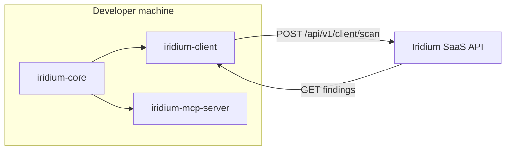

```text
╔══════════════════════════════════════════════════════════════════════════════╗
║                                                                              ║
║   ██╗██████╗ ██╗██████╗ ██╗██╗   ██╗███╗   ███╗                              ║
║   ██║██╔══██╗██║██╔══██╗██║██║   ██║████╗ ████║                              ║
║   ██║██████╔╝██║██║  ██║██║██║   ██║██╔████╔██║                              ║
║   ██║██╔══██╗██║██║  ██║██║██║   ██║██║╚██╔╝██║                              ║
║   ██║██║  ██║██║██████╔╝██║╚██████╔╝██║ ╚═╝ ██║                              ║
║   ╚═╝╚═╝  ╚═╝╚═╝╚═════╝ ╚═╝ ╚═════╝ ╚═╝     ╚═╝                              ║
║                                                                              ║
║.---[ A.I CYBER REASONING SYSTEM · CLIENT LAYER ]----------------------------.║
║|  local AST/graph  ·  CLI scan  ·  MCP guardrails  ·  cloud reachability    |║
║'----------------------------------------------------------------------------'║
║                                                                              ║
╚══════════════════════════════════════════════════════════════════════════════╝

  release ....... iridium-client / iridium-core / iridium-mcp-server
  type .......... open-source client for the Iridium offensive research platform
  pypi .......... iridium-core · iridium-client · iridium-mcp-server
  platform ...... under active development — SaaS access limited during onboarding
```

[](https://github.com/mziqudhd92/Iridium/actions/workflows/ci.yml)
[](https://pypi.org/project/iridium-core/)
[](https://pypi.org/project/iridium-client/)
[](https://pypi.org/project/iridium-mcp-server/)
[](LICENSE)

## What is Iridium?

Iridium is an **offensive security and red-team research platform** built to find **unknown vulnerabilities**. Multi-role AI reasoning plus **dynamic runtime verification**: isolate sinks, synthesize PoCs, prove crashes in sandboxes, ship bounty-ready packages.

**This repo** is the open-source **client layer**: local AST extraction, dependency graphs, CLI scanning, and MCP guardrails that feed the private Iridium engine.

| Stage | What it does |
| --- | --- |
| **VERIFY** | C/C++ ASan harnesses in isolated Docker sandboxes |
| **REASON** | Triage → Planner → Reasoner → Coder attack-path mapping |
| **PATCH** | Maintainer-grade unified diffs |
| **PACKAGE** | PoCs + reports + patches in submission-ready ZIPs |

The Hunter Engine, verification backend, and SaaS API are **not yet publicly available** — access is limited while we onboard early users.

## Quick start

```bash
pip install iridium-client

# Zero-install demo (<10s, no API key)
uvx iridium-client demo

# Full scan — local parsing + cloud reachability (anonymous tier OK)
iridium-client scan .

# Optional: higher quotas / pro features
# export IRIDIUM_API_KEY=iridium_live_...
```

Local payload dump (zero network):

```bash
iridium-client payload dump . --validate
```

## Packages

| Package | Install | Role |
| --- | --- | --- |
| `iridium-core` | `pip install iridium-core` | AST, graph, cache — no network |
| `iridium-client` | `pip install iridium-client` | Typer CLI + SaaS client |
| `iridium-mcp-server` | `pip install iridium-mcp-server` | MCP guardrails for AI agents |

## Architecture



Technical details: [openapi/client-scan-api-v1.yaml](openapi/client-scan-api-v1.yaml) · [schema/client-scan-payload-v1.json](schema/client-scan-payload-v1.json)

## Environment

| Variable | Default | Description |
| --- | --- | --- |
| `IRIDIUM_API_URL` | `https://api.iridium.example.com` | SaaS API base URL |
| `IRIDIUM_API_KEY` | — | Optional — higher limits / patches |
| `DO_NOT_TRACK` | unset | Set `1` to disable analytics |
| `IRIDIUM_ANON_KEY` | — | HMAC key for `--anonymize` mode |

See [`packages/iridium-client/.env.example`](packages/iridium-client/.env.example).

## Development

```bash
git clone https://github.com/mziqudhd92/Iridium.git
cd Iridium
uv sync
uv run pytest
```

## Security

See [SECURITY.md](SECURITY.md) for reporting, threat model, and privacy defaults.

## License

Apache-2.0 — see [LICENSE](LICENSE). Contributions require [DCO](DCO) sign-off.
