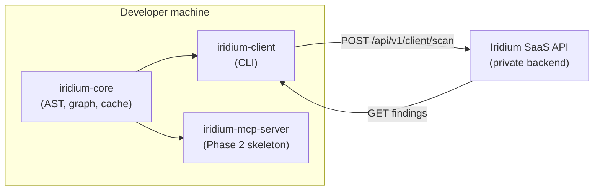

# Iridium

Client-side security scanning: local AST extraction, dependency graph assembly, and CLI upload to Iridium SaaS for reachability analysis.

[](https://github.com/mziqudhd92/Iridium/actions/workflows/ci.yml)
[](https://pypi.org/project/iridium-client/)
[](LICENSE)

## Architecture



| Package | PyPI | Role |
| --- | --- | --- |
| `iridium-core` | [`pip install iridium-core`](https://pypi.org/project/iridium-core/) | Extractors, cache, graph, payload models (no network) |
| `iridium-client` | [`pip install iridium-client`](https://pypi.org/project/iridium-client/) | Typer CLI + httpx SaaS client |
| `iridium-mcp-server` | [`pip install iridium-mcp-server`](https://pypi.org/project/iridium-mcp-server/) | MCP server skeleton for AI agents (Phase 2) |

The **private SaaS backend** (CVE intelligence, reachability workers, patches) lives in a separate repository — not in this OSS monorepo.

## Quick start

```bash
pip install iridium-client

# Zero-install demo (<10s, no API key)
uvx iridium-client demo

# Full scan (requires IRIDIUM_API_KEY when API is live)
export IRIDIUM_API_URL=https://api.iridium.example.com
export IRIDIUM_API_KEY=iridium_live_...
iridium-client scan .
```

Local payload dump (zero network):

```bash
iridium-client payload dump . --validate
```

## Environment variables

| Variable | Default | Description |
| --- | --- | --- |
| `IRIDIUM_API_URL` | `https://api.iridium.example.com` | SaaS API base URL (no trailing slash) |
| `IRIDIUM_API_KEY` | — | API key for authenticated scans (`X-API-Key` header) |
| `DO_NOT_TRACK` | unset | Set to `1` to disable product analytics pings |
| `IRIDIUM_TELEMETRY` | `1` | Set to `0` to disable analytics (also `--no-telemetry`) |
| `IRIDIUM_ANON_KEY` | — | HMAC key for `--anonymize` blind-graphing mode |
| `IRIDIUM_PUBLIC_URL` | — | Public dashboard URL for sharing reports |

See [`packages/iridium-client/.env.example`](packages/iridium-client/.env.example).

## Monorepo structure

```
packages/
  iridium-core/       # LanguageExtractor plugins, Tarjan SCC, AST cache
  iridium-client/     # CLI, demo, terminal output
  iridium-mcp-server/ # MCP skeleton (Phase 1)
openapi/client-scan-api-v1.yaml
schema/client-scan-payload-v1.json
```

Repository: [github.com/mziqudhd92/Iridium](https://github.com/mziqudhd92/Iridium)

## Development

```bash
git clone https://github.com/mziqudhd92/Iridium.git
cd Iridium
uv sync
uv run pytest
```

Build wheels for a single package:

```bash
uv build --package iridium-core
uv build --package iridium-client
uv build --package iridium-mcp-server
```

## API contract

Stable paths under `{IRIDIUM_API_URL}/api/v1/client/*`:

- `POST /api/v1/client/scan` → 202 + `scan_id`
- `GET /api/v1/client/scan/{scan_id}` → poll findings

See [openapi/client-scan-api-v1.yaml](openapi/client-scan-api-v1.yaml) and [schema/client-scan-payload-v1.json](schema/client-scan-payload-v1.json).

## Security

See [SECURITY.md](SECURITY.md) for vulnerability reporting, client-side threat model, and privacy defaults.

**Phase 1 limitations:**

- **Local audit log** (`.iridium/audit.log`) is planned but **not yet implemented**.
- **`--anonymize`** HMAC-hashes internal symbols in graph payloads; available on `iridium-client scan`.
- **Product analytics** are on by default (anonymized operational pings, no AST/source); opt out with `DO_NOT_TRACK=1` or `--no-telemetry`.
- Graph payloads contain syntactic structure only — string literals and secrets are stripped client-side.

## License

Apache-2.0 — see [LICENSE](LICENSE). Contributions require [DCO](DCO) sign-off.
