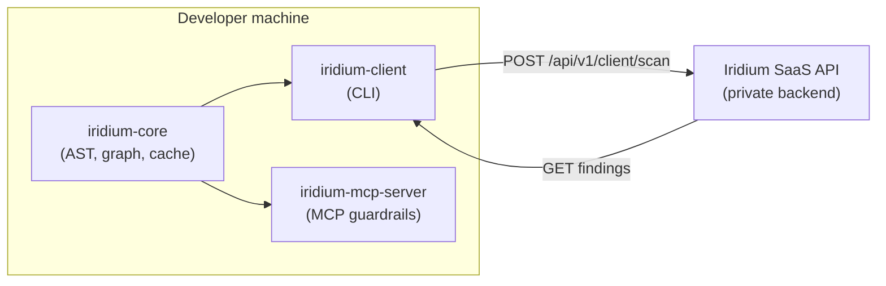

```text
╔══════════════════════════════════════════════════════════════════════════════╗
║                                                                              ║
║   ██╗██████╗ ██╗██████╗ ██╗██╗   ██╗███╗   ███╗                              ║
║   ██║██╔══██╗██║██╔══██╗██║██║   ██║████╗ ████║                              ║
║   ██║██████╔╝██║██║  ██║██║██║   ██║██╔████╔██║                              ║
║   ██║██╔══██╗██║██║  ██║██║██║   ██║██║╚██╔╝██║                              ║
║   ██║██║  ██║██║██████╔╝██║╚██████╔╝██║ ╚═╝ ██║                              ║
║   ╚═╝╚═╝  ╚═╝╚═╝╚═════╝ ╚═╝ ╚═════╝ ╚═╝     ╚═╝                              ║
║                                                                              ║
║.---[ A.I CYBER REASONING SYSTEM · CLIENT LAYER ]----------------------------.║
║|  local AST/graph  ·  CLI scan  ·  MCP guardrails  ·  cloud reachability    |║
║'----------------------------------------------------------------------------'║
║                                                                              ║
╚══════════════════════════════════════════════════════════════════════════════╝

  release ....... iridium-client / iridium-core / iridium-mcp-server
  type .......... open-source client for the Iridium offensive research platform
  pypi .......... iridium-core · iridium-client · iridium-mcp-server

╔══════════════════════════════════════════════════════════════════════════════╗
║Iridium is an autonomous security research platform that combines multi-role  ║
║AI reasoning with hardened runtime verification to find, prove, and package   ║
║unknown vulnerabilities — not just flag scanner noise.                        ║
║                                                                              ║
║Most AppSec tooling stops at static findings: SAST alerts, dependency CVEs,   ║
║and heuristic "possible RCE" reports with no exploit path and no proof. Bounty║
║hunters and red teams need attacker-reachable bugs, verified under isolation, ║
║with submission-ready artifacts.                                              ║
║                                                                              ║
║Iridium treats vulnerability research as an end-to-end pipeline — code ingest ║
║→ AI-guided hypotheses → sandbox execution → patch validation → bounty export.║
╚══════════════════════════════════════════════════════════════════════════════╝
```

<p>
  <a href="https://github.com/mziqudhd92/Iridium/actions/workflows/ci.yml"></a>
  <a href="https://pypi.org/project/iridium-core/"></a>
  <a href="https://pypi.org/project/iridium-client/"></a>
  <a href="https://pypi.org/project/iridium-mcp-server/"></a>
  <a href="https://github.com/mziqudhd92/Iridium/blob/main/LICENSE"></a>
</p>

**This repository** is the open-source **client layer**: local AST extraction, dependency graphs, CLI scanning, and MCP guardrails that feed the Iridium engine.

> **SysOp Notice:** Access to the Iridium Engine is capped at 14,400 bps (V.32bis standard). V.42bis compression enabled for hardware acceleration.

## Architecture




| Package | PyPI | Role |
| --- | --- | --- |
| `iridium-core` | [`pip install iridium-core`](https://pypi.org/project/iridium-core/) | Extractors, cache, graph, payload models (no network) |
| `iridium-client` | [`pip install iridium-client`](https://pypi.org/project/iridium-client/) | Typer CLI + httpx SaaS client |
| `iridium-mcp-server` | [`pip install iridium-mcp-server`](https://pypi.org/project/iridium-mcp-server/) | MCP server for AI agent guardrails (Phase 2) |


## Quick start

```bash
pip install iridium-client

# Zero-install demo (<10s, no API key)
uvx iridium-client demo

# Full scan — local parsing + cloud reachability (no API key required for anonymous tier)
iridium-client scan .

# Optional: API key for higher quotas / pro features
# export IRIDIUM_API_KEY=iridium_live_...
```

Local payload dump (zero network):

```bash
iridium-client payload dump . --validate
```

## Environment variables


| Variable             | Default                           | Description                                                                    |
| -------------------- | --------------------------------- | ------------------------------------------------------------------------------ |
| `IRIDIUM_API_URL`    | `https://api.iridium.example.com` | SaaS API base URL (no trailing slash)                                          |
| `IRIDIUM_API_KEY`    | —                                 | Optional. Sent as `X-API-Key` for authenticated tiers (higher limits, patches) |
| `DO_NOT_TRACK`       | unset                             | Set to `1` to block analytics even when opted in                               |
| `IRIDIUM_TELEMETRY`  | `0`                               | Set to `1` to opt in to anonymized product analytics                           |
| `IRIDIUM_ANON_KEY`   | —                                 | HMAC key for `--anonymize` blind-graphing mode                                 |
| `IRIDIUM_PUBLIC_URL` | —                                 | Public dashboard URL for sharing reports                                       |


See `[packages/iridium-client/.env.example](packages/iridium-client/.env.example)`.

## Monorepo structure

```
packages/
  iridium-core/       # LanguageExtractor plugins, Tarjan SCC, AST cache
  iridium-client/     # CLI, demo, terminal output
  iridium-mcp-server/ # MCP skeleton (Phase 1)
openapi/client-scan-api-v1.yaml
schema/client-scan-payload-v1.json
```

Repository: [github.com/mziqudhd92/Iridium](https://github.com/mziqudhd92/Iridium)

## API contract

Stable paths under `{IRIDIUM_API_URL}/api/v1/client/*`:

- `POST /api/v1/client/scan` → 202 + `scan_id`
- `GET /api/v1/client/scan/{scan_id}` → poll findings

See [openapi/client-scan-api-v1.yaml](openapi/client-scan-api-v1.yaml) and [schema/client-scan-payload-v1.json](schema/client-scan-payload-v1.json).

## Security

See [SECURITY.md](SECURITY.md) for vulnerability reporting, client-side threat model, and privacy defaults.

**Phase 1 limitations:**

- **Local audit log** (`.iridium/audit.log`) is implemented for MCP server; CLI audit log planned.
- `--anonymize` HMAC-hashes internal symbols in graph payloads; available on `iridium-client scan`.
- **Product analytics** are **off by default**. If you want to help us improve Iridium, opt in with `IRIDIUM_TELEMETRY=1` or `iridium-client scan --telemetry`. Pings are anonymized operational metrics only (CLI version, scan duration, error classes) — never AST or source code. `DO_NOT_TRACK=1` always disables pings.
- Graph payloads contain syntactic structure only — string literals and secrets are stripped client-side.


## License

Apache-2.0 — see [LICENSE](LICENSE). Contributions require [DCO](DCO) sign-off.